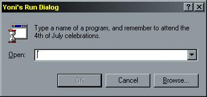

<div align="center">

## A few SHORT, USEFUL FUNCTIONS using APIs that you've never heard of, with many comments\!


</div>

### Description

Let's see what I have... You can use my functions to display the Change Icon Dialog, just like in the shortcut properties (Updated: NOW WORKS!). You can check if a file has an executable extension. You can show the Exit Windows MsgBox ("You must restart for the changes to go to bed"). And you can show the Run Dialog (see screen shot).
 
### More Info
 
There are many! Each function has its own, and the code has many comments in it, you'll know.

It's very well commented IMHO, so if you know how subs and functions generally work (and any programmer knows that) you will understand how to use the code. You need just slightly more than that to actually understand the code, though. But you'll manage =)

Usually? True on success, False on failure. *grin*

The Exit Windows MsgBox may accidentally exit windows! Oh no!


<span>             |<span>
---                |---
**Submitted On**   |2000-07-12 22:39:34
**By**             |[N/A](https://github.com/Planet-Source-Code/PSCIndex/blob/master/ByAuthor/empty.md)
**Level**          |Advanced
**User Rating**    |4.5 (49 globes from 11 users)
**Compatibility**  |VB 3\.0, VB 4\.0 \(16\-bit\), VB 4\.0 \(32\-bit\), VB 5\.0, VB 6\.0, VB Script, ASP \(Active Server Pages\) 
**Category**       |[Miscellaneous](https://github.com/Planet-Source-Code/PSCIndex/blob/master/ByCategory/miscellaneous__1-1.md)
**World**          |[Visual Basic](https://github.com/Planet-Source-Code/PSCIndex/blob/master/ByWorld/visual-basic.md)
**Archive File**   |[CODE\_UPLOAD77317122000\.zip](https://github.com/Planet-Source-Code/a-few-short-useful-functions-using-apis-that-you-ve-never-heard-of-with-many-comments__1-9669/archive/master.zip)

### API Declarations

```
' There are exactly ten declarations and fourteen constants!
' Check the code out!
' Please vote if you find it useful, and please give feedback even if you don't!
```


